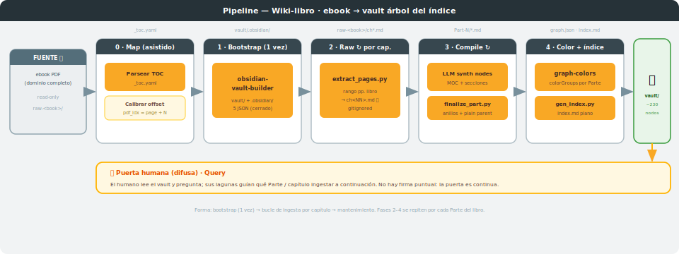
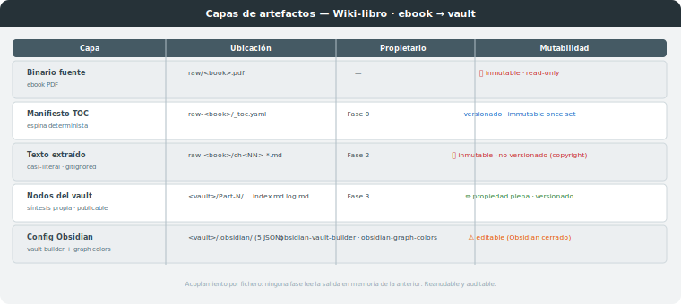
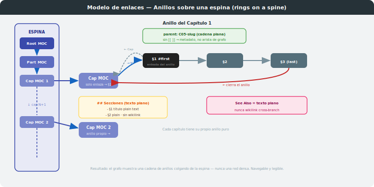

# Proceso: Wiki-libro — ebook → vault árbol del índice

**Skills involucrados:** `karpathy-llm-wiki-book` (orquestador) → `obsidian-vault-builder` → `obsidian-graph-colors`
**Entrada:** **un** ebook (PDF que es un dominio entero) · **Salida:** vault de Obsidian cuyo grafo reproduce el **índice del libro**
**Caso guía:** BDA3 — *Bayesian Data Analysis* (Gelman et al., 677 pp) → `wiki-bda3/`
**Última actualización:** 2026-06-17

> **Variante de fuente única del [`proceso-wiki`](../proceso-wiki/PROCESO.md).** Aquel compila un
> *corpus de muchas fuentes* e **inventa** la estructura por *topic*. Este compila **una sola fuente
> que ya trae su estructura** (el TOC) y la **reproduce** como árbol de nodos. No se inventa la
> organización: se calca el índice. Sigue la receta portable documentada en
> [`docs/obsidian-llm-wiki/`](../obsidian-llm-wiki/PROCESO.md).

---

## 1. Visión general

El proceso convierte **un ebook** en un **vault de Obsidian** cuyo **grafo es el árbol del índice del
libro**: un nodo *MOC* (mapa) por capítulo —el nodo "principal"— y un nodo por cada sección del TOC,
cableados en un **árbol estrictamente descendente** Parte → Capítulo → Sección. Rige el principio de
Karpathy (**"el LLM escribe el wiki; el humano lee y pregunta"**) y el **acoplamiento por fichero**:
ningún paso lee la salida en memoria del anterior, se comunican por artefactos en disco → el proceso
es **reanudable y auditable**.

Cinco fases, con `karpathy-llm-wiki-book` como **orquestador** que delega el bootstrap y el coloreado:



| Fase | Qué hace | Entrada | Salida (artefacto de interfaz) |
|---|---|---|---|
| 0 · Map | parsea el TOC y **calibra el offset** PDF↔página-de-libro | ebook 🔒 | `raw-<book>/_toc.yaml` (espina determinista) |
| 1 · Bootstrap (una vez) | crea el vault + `.obsidian/` (delega) | — | `<vault>/.obsidian/` (5 JSON) |
| 2 · Raw | extrae texto **por capítulo** por rango de páginas | `_toc.yaml` + ebook 🔒 | `raw-<book>/ch<NN>-*.md` 🔒 (gitignored) |
| 3 · Compile | sintetiza el árbol de nodos (MOC + secciones) | raw + `_toc.yaml` | nodos del vault + `index.md` |
| 4 · Color + log | colorea el grafo y registra | nodos | `graph.json` + `<vault>/log.md` |

---

## 2. Arquitectura de artefactos

Acoplamiento **por fichero**; la frontera con las fuentes es inmutable.



| Capa | Ubicación | Propietario | Mutabilidad |
|---|---|---|---|
| **Binario fuente** | el ebook (`raw/<book>.pdf`) | — | 🔒 inmutable, read-only |
| **Manifiesto TOC** | `raw-<book>/_toc.yaml` | Fase 0 | espina determinista · **versionado** |
| **Raw extraído** | `raw-<book>/ch<NN>-*.md` | Fase 2 | 🔒 inmutable una vez creado · **gitignored** (casi-literal) |
| **Nodos del vault** | `<vault>/<Part>/…` + `index.md` + `log.md` | Fase 3 | propiedad plena · conocimiento **sintetizado** |
| **Config Obsidian** | `<vault>/.obsidian/` | `obsidian-vault-builder` · `obsidian-graph-colors` | editable (⚠ Obsidian cerrado) |

> **Copyright.** El vault publica **síntesis propia**, nunca transcripción (el caso guía BDA3 es
> "non-commercial"). El texto extraído `raw-<book>/*.md` se **gitignorea**; solo `_toc.yaml`
> (estructura: títulos + páginas) se versiona.

---

## 3. Las cinco fases

### Fase 0 — Map (calibrar + manifiesto)
Parsea el TOC a `raw-<book>/_toc.yaml` con `type`/`toc`/`title`/`page`/`pages` por unidad. **Calibra el
offset**: las páginas del TOC son *páginas de libro*, no índices del PDF; se localiza el índice PDF de
una cabecera de capítulo conocida y se fija `pdf_idx = book_page + offset`, **verificándolo en ≥3
capítulos** repartidos por el libro (puede haber láminas insertadas). *Asistido-manual* (los TOC varían
demasiado para un parser frágil). **Caso BDA3:** offset = 9, constante en las 677 páginas; 5 partes/23
caps/192 secciones/3 apéndices.

### Fase 1 — Bootstrap (una vez) · delega en `obsidian-vault-builder`
Crea `<vault>/` + `.obsidian/` con Obsidian **cerrado**. Perfil *tree*: plugins `graph`, `backlink`,
`outgoing-link`, `outline`, `tag-pane`; layout `graph-center`; grafo sin colorGroups (colores → Fase 4).

### Fase 2 — Raw (por capítulo) · motor `extract_pages.py`
`python engine/extract_pages.py --pdf … --from <bp> --to <bp> --offset <o> --out raw-<book>/ch<NN>-<slug>.md`.
Inserta marcadores `===== book p.N =====` para que el compile localice cada sección. Inmutable.

### Fase 3 — Compile (árbol de nodos)
Sintetiza cuatro tipos de nodo (Karpathy compile, nunca copia):
- **Root MOC** `<BOOK>-index.md` → ↓ Partes + apéndices.
- **Part MOC** `P<n>-<slug>.md` → ↓ capítulos · ↑ root.
- **Chapter MOC** (nodo "principal") `C<NN>-<slug>.md` → ↓ secciones · ↑ Parte.
- **Section** `S<NN>-<MM>-<slug>.md` → conocimiento sintetizado · ↑ Capítulo. Subsecciones = encabezados
  internos, no nodos.

Nombres con prefijo único (`C05`, `S05-02`) → wikilinks estables y orden natural. Construye `index.md`
(índice plano que enlaza solo a los Capítulo-MOC).

### Fase 4 — Color + log · delega en `obsidian-graph-colors`
Colorea (Obsidian cerrado) **por Parte** (`tag:#part-N`) + raíz (`tag:#root`); los MOC heredan el color de su
Parte (cada Parte = un cluster uniforme). Los tags `#moc` y `ch<NN>` **no llevan colorGroup** (solo filtran). Registra en
`<vault>/log.md`. Las operaciones de proceso/código van a `sessions/`, no al `log.md` del vault.

---

## 4. El modelo de enlaces: anillos sobre una espina (rings on a spine)



Es la **decisión de diseño central** del proceso (puerta humana del caso guía, 2026-06-17, en tres pasos:
(1) se eliminó la malla dejando un árbol; (2) se añadió navegación secuencial; (3) se refinó a un **anillo
puro** por capítulo). Obsidian dibuja una arista por cada wikilink; cada capítulo se redacta como un **ciclo
limpio** a través de su MOC:

```
Cap.MOC → S1 ↔ S2 ↔ … ↔ Sn → Cap.MOC
```

- El **MOC enlaza solo a la primera sección** (entrada del anillo). Su bloque `## Secciones` lista todas las
  secciones como **texto plano** — no como wikilinks — así el MOC **no** tiene radios a las secciones intermedias.
- **Primera sección:** pie `← [[Cap. N]] · [[§sig]] →` (su "anterior" es el capítulo).
- **Secciones intermedias:** pie `← [[§ant]] · [[§sig]] →` — **sin enlace al capítulo**, solo a sus dos vecinas.
- **Última sección:** pie `← [[§ant]] · [[Cap. N]] →` — su "siguiente" es el capítulo; esa única flecha de
  salida **cierra el anillo** (el capítulo nunca apunta de vuelta a la última sección).
- Por tanto **solo la primera y la última sección tocan el nodo del capítulo**; el resto son miembros puros del
  anillo. El `parent` del frontmatter es una **cadena plana** (`parent: C05-…`, sin `[[ ]]`) → metadato, no arista.
- **Prohibido:** los cross-refs *See Also* **clicables** entre capítulos (aristas *cross-branch* = malla); se
  conservan como **texto plano**. Los Capítulo-MOC se encadenan a su vez con un anillo de capítulos
  (`← [[Cap. ant]] · ↑ [[Parte]] · [[Cap. sig]] →`). Patrón tomado de
  [`lab-guide-ring`](../../.claude/skills/lab-guide-ring/SKILL.md).

Resultado en el caso guía: **56 nodos**; un anillo por capítulo (solo extremos tocan el MOC) colgando de la
espina raíz → Parte → Capítulos; **0 aristas cross-branch**. El `index.md` plano se recorta para enlazar solo
a los 5 Capítulo-MOC.

---

## 5. Forma del proceso y puerta humana

Como `proceso-wiki`, la topología es **bootstrap (una vez) → bucle de ingesta (por capítulo/Parte) →
mantenimiento**, no una tubería de una pasada. La **puerta humana** es doble:
1. **Difusa / continua** (Karpathy): el humano lee el vault y pregunta (Query); sus lagunas guían qué
   Parte ingerir a continuación.
2. **Explícita de criterio**: la decisión del **modelo de enlaces** (árbol descendente) la firmó el
   profesor tras revisar el piloto — y quedó baked en el skill para que las Partes siguientes nazcan
   solo-árbol, sin pasada de re-estructura.

---

## 6. Referencia rápida — triggers

| Skill | Trigger | Acción |
|---|---|---|
| `karpathy-llm-wiki-book` | "bootstrap a book vault" / "ingest this ebook" / "wiki from a book" | Map → Bootstrap → Raw → Compile → Color |
| `obsidian-vault-builder` | (delegado) "bootstrap vault" | crea `<vault>/` + `.obsidian/` |
| `obsidian-graph-colors` | (delegado) "colorea el grafo" | colorGroups por tag (Obsidian cerrado) |
| `karpathy-llm-wiki-book` | "¿qué dice <libro> sobre X?" | Query: sintetiza y cita (no escribe) |
| `karpathy-llm-wiki-book` | "lint del vault" | auto-fix de árbol + reporte |

---

## 7. Limitaciones conocidas y decisiones de diseño

| Aspecto | Decisión | Razón |
|---|---|---|
| Skill nuevo vs. parámetro del base | Skill aparte (`karpathy-llm-wiki-book`) | La compilación es **determinista por TOC**, no por tesis; el árbol no existe en el base |
| Vault separado por libro | Sí (`wiki-bda3/`) | Aísla el árbol-libro del vault de curso por *topic* |
| Granularidad | Capítulo-MOC + sección; subsección = encabezado | El TOC solo da hasta sección; evita leer el cuerpo para descubrir el sub-árbol |
| **Modelo de enlaces: anillos sobre una espina** | Anillo puro por capítulo (`Cap→S1↔…↔Sn→Cap`); solo extremos tocan el MOC; `parent` plano; sin See Also clicable | Navegable y legible; cada capítulo es un ciclo limpio, no una rueda con radios ni una malla |
| `raw-<book>/` gitignored | Sí | Texto casi-literal de obra "non-commercial"; el vault publica síntesis |
| Offset PDF↔libro | Calibrar + verificar en Fase 0 | Las páginas del TOC ≠ índices del PDF |
| `index.md` recortado | Enlaza solo a Capítulo-MOC | Evita una estrella de 56 radios que compita con el árbol |
| Conductor = skill | `karpathy-llm-wiki-book` orquesta | Las fases de extracción/compilación se repiten por Parte de forma fiable |
| Diagramas SVG | **Generados** (`svg/diag-01` pipeline · `svg/diag-02` artefactos · `svg/diag-03` link-model) | Creados en sesión 2026-06-17; copiados al REPO standalone |

---

*Skill en `.claude/skills/karpathy-llm-wiki-book/` (+ `engine/extract_pages.py`). Receta portable (standalone repo): [`REPO/`](REPO/). Hermano:
[`proceso-wiki`](../proceso-wiki/PROCESO.md) (vault de curso por topic). Caso guía: `wiki-bda3/` (BDA3 — 23 capítulos + 3 apéndices, ~230 nodos, completado 2026-06-17).*
